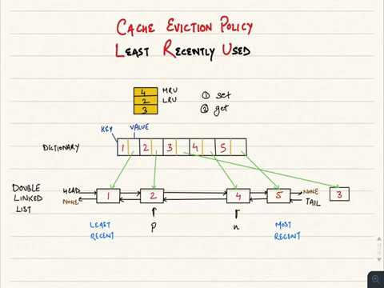
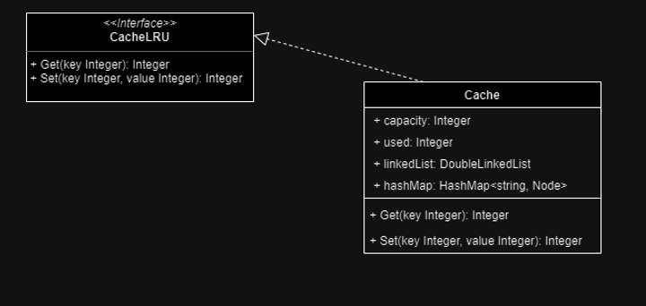

# CACHE LRU

## Introduction

Cache LRU is a cache evict policy to delete the Least Recently Used cache entry, used when the cache is at the maximun capacity and we're trying to add a new entry.

## Class diagram

## Unit tests

In progress

## Benchmark

In progress

## Disclaimer

This is a simple challenge, made to practice with use of different data structure i'm used to.

Is just for fun!
